<p align="center">
  
  
</p>

<h1 align="center">Before & After: PDF Output Enhancement</h1>

<p align="center">
Visual comparison of the PDF generation feature upgrade
</p>

---

## Output Structure Comparison


---

## Feature Comparison

| Feature | Before | After |
|:--------|:------:|:-----:|
| **Output Formats** | Text only | Text + PDF |
| **Formatting** | None | Professional |
| **Readability** | Basic | Excellent |
| **Print Quality** | Poor | High |
| **Executive Ready** | No | Yes |
| **Markdown Support** | No | Yes |
| **Styled Headings** | No | Yes |
| **Formatted Bullets** | No | Yes |
| **Bold Text** | No | Yes |
| **Page Layout** | N/A | Optimized |

---

## Use Case Improvements

```mermaid
%%{init: {'theme': 'base'}}%%
flowchart TB
    subgraph Technical["🔧 Technical Teams"]
        T1["Open text in notepad<br/>Hard to scan<br/>No hierarchy"]
        T2["Professional PDF<br/>Clear structure<br/>Easy navigation"]
        T1 -->|"Upgrade"| T2
    end

    subgraph Management["👔 Management"]
        M1["Unprofessional files<br/>Hard to present<br/>Not meeting-ready"]
        M2["Professional PDFs<br/>Executive ready<br/>Board presentations"]
        M1 -->|"Upgrade"| M2
    end

    subgraph Compliance["📋 Compliance"]
        C1["Basic text docs<br/>Not archival quality<br/>Hard to organize"]
        C2["Professional docs<br/>Archival-quality<br/>Audit-ready"]
        C1 -->|"Upgrade"| C2
    end

    style T1 fill:#fee2e2,stroke:#ef4444
    style M1 fill:#fee2e2,stroke:#ef4444
    style C1 fill:#fee2e2,stroke:#ef4444
    style T2 fill:#dcfce7,stroke:#22c55e
    style M2 fill:#dcfce7,stroke:#22c55e
    style C2 fill:#dcfce7,stroke:#22c55e
```



---

## Content Formatting Example

<table>
<tr>
<th>Before (Plain Text)</th>
<th>After (Formatted PDF)</th>
</tr>
<tr>
<td>

```
EXECUTIVE SUMMARY
=================

CURRENT STATE:
TechCorp Industries' policy 
provides a foundational...

KEY FINDINGS:
- Missing risk management
- Lack of data classification
- Insufficient incident response
```

</td>
<td>

```
┌────────────────────────────────┐
│                                │
│     EXECUTIVE SUMMARY          │  ← Centered title
│                                │
│  CURRENT STATE:                │  ← Bold heading
│  TechCorp Industries' policy   │
│  provides a foundational...    │  ← Justified text
│                                │
│  KEY FINDINGS:                 │  ← Bold heading
│  • Missing risk management     │  ← Formatted bullets
│  • Lack of data classification │
│  • Insufficient incident resp  │
│                                │
└────────────────────────────────┘
```

</td>
</tr>
</table>

---

## Real-World Impact

| Scenario | Before | After |
|----------|--------|-------|
| **Executive Presentation** | "Here's a text file..." | "Here's a professional PDF report..." |
| **Compliance Audit** | Submit plain text files | Submit professional PDF documentation |
| **Team Review** | Hard to annotate text files | Easy to annotate and discuss PDFs |
| **Archival** | Text files in folders | Professional PDFs with formatting |

---

## Implementation Stats


| Metric | Value |
|--------|-------|
| **Lines Added** | ~165 lines |
| **Files Created** | 4 new files |
| **Files Modified** | 2 files |
| **Breaking Changes** | 0 (backward compatible) |
| **Time Impact** | +1-2 seconds per report |
| **Setup Required** | `pip install reportlab` |

---

## Success Checklist

### Technical Success
- [x] All PDFs generated successfully
- [x] Proper formatting applied
- [x] No errors or warnings
- [x] Backward compatible

### Quality Success
- [x] Professional appearance
- [x] Print-ready quality
- [x] Proper spacing and layout
- [x] Readable fonts and sizes

### User Success
- [x] Easy to use (automatic)
- [x] No additional steps required
- [x] Text backup still available
- [x] Clear documentation provided

---

## Summary

| Aspect | Before | After |
|--------|--------|-------|
| **Output** | Basic text, functional but unprofessional | Professional PDFs + text backup |
| **Effort** | — | ~165 lines of code |
| **Impact** | — | Significant usability improvement |
| **Result** | — | Production-ready enhancement |

---

<p align="center">
  <strong>The system now generates professional, formatted PDF reports automatically!</strong>
</p>

<p align="center">
  <sub>Made With 💗 by T-reXploit</sub>
</p>
