<p align="center">
  
  
  
  
</p>

<h1 align="center">Local LLM Policy Gap Analyzer</h1>
<h3 align="center">Privacy-First Cybersecurity Policy Analysis Against NIST CSF Standards</h3>

<p align="center">
A fully offline, lightweight system for analyzing organizational cybersecurity policies against NIST Cybersecurity Framework standards using a local Large Language Model.
</p>

---

## Introduction

Organizations struggle to maintain cybersecurity policies that align with industry standards. This tool provides **automated gap analysis** by comparing your policies against the **NIST Cybersecurity Framework** using a local LLM (Gemma3 via Ollama). Every operation runs entirely on your machine—**no cloud APIs, no data collection, complete privacy**.

The system identifies policy weaknesses, generates revised policies addressing those gaps, and creates phased implementation roadmaps—all in professional PDF and text formats.

---

## Table of Contents

| Section | Description |
|---------|-------------|
| [Features](#features) | Core capabilities |
| [Tech Stack](#tech-stack--prerequisites) | Technologies and requirements |
| [Architecture](#architecture-diagram) | Visual system overview |
| [Project Structure](#project-structure) | File organization |
| [Quick Start](#quick-start-user-instructions) | Get running in 5 minutes |
| [Developer Guide](#developer-guide) | Contributing code |
| [Contributor Expectations](#contributor-expectations) | Guidelines for contributors |
| [Known Issues](#known-issues--limitations) | Current limitations |

---

## Features

| Feature | Description |
|---------|-------------|
| **Gap Analysis** | Identifies policy weaknesses against NIST CSF standards |
| **Policy Revision** | Auto-generates improved policy versions addressing gaps |
| **Implementation Roadmap** | Phased improvement plans (0-3, 3-6, 6-12 months) |
| **Executive Summary** | Leadership-ready overview of findings |
| **Multi-Format Input** | Supports `.txt`, `.pdf`, and `.docx` policies |
| **PDF Output** | Professional formatted reports using ReportLab |
| **Batch Processing** | Analyze multiple policies in one run |
| **100% Offline** | Zero network calls after initial setup |

---

## Tech Stack & Prerequisites

### Technology Stack

```mermaid
%%{init: {'theme': 'base', 'themeVariables': { 'primaryColor': '#6366f1'}}}%%
flowchart TB
    subgraph AppLayer["🖥️ APPLICATION LAYER"]
        direction LR
        PY["🐍 Python 3.8+<br/>Core Runtime"]
        CLI["⌨️ CLI Interface<br/>argparse module"]
        PDF["📄 PDF Engine<br/>ReportLab 4.0+"]
    end

    subgraph LLMLayer["🤖 LLM LAYER"]
        direction LR
        OLL["🦙 Ollama<br/>Runtime Engine"]
        GEM["💎 Gemma3<br/>Local Model"]
    end

    subgraph DocLayer["📁 DOCUMENT PROCESSING"]
        direction LR
        PYPDF["📕 PyPDF2<br/>PDF Extraction"]
        DOCX["📘 python-docx<br/>Word Parsing"]
        TXT["📝 UTF-8<br/>Text Reading"]
    end
    
    subgraph RefLayer["📚 REFERENCE"]
        NIST["🛡️ NIST CSF<br/>CIS MS-ISAC 2024"]
    end

    AppLayer ==> LLMLayer
    LLMLayer ==> DocLayer
    RefLayer -.->|Standards| LLMLayer

    style AppLayer fill:#dbeafe,stroke:#3b82f6,stroke-width:2px
    style LLMLayer fill:#fce7f3,stroke:#ec4899,stroke-width:2px
    style DocLayer fill:#dcfce7,stroke:#22c55e,stroke-width:2px
    style RefLayer fill:#f3e8ff,stroke:#a855f7,stroke-width:2px
```



### System Requirements

| Component | Minimum | Recommended |
|-----------|---------|-------------|
| **CPU** | Intel i5 / AMD Ryzen 5 | Intel i7 / AMD Ryzen 7 |   
| **RAM** | 8 GB | 16 GB |
| **Storage** | 10 GB | 20 GB |
| **OS** | Windows 10 / Linux / macOS | Windows 11 / Ubuntu 22.04 |

### Dependencies

| Package | Version | Purpose |
|---------|---------|---------|
| `PyPDF2` | >= 3.0 | PDF text extraction |
| `python-docx` | >= 0.8 | Word document parsing |
| `reportlab` | >= 4.0 | PDF report generation |
| `ollama` | (runtime) | Local LLM execution |

---

## Architecture Diagram

### System Overview

```mermaid
%%{init: {'theme': 'base', 'themeVariables': { 'primaryColor': '#4f46e5', 'primaryTextColor': '#fff', 'primaryBorderColor': '#3730a3', 'lineColor': '#6366f1', 'secondaryColor': '#f0f9ff', 'tertiaryColor': '#e0e7ff'}}}%%
flowchart TB
    subgraph UserInput["📄 INPUT LAYER"]
        direction LR
        TXT["📝 Text Files<br/>.txt"]
        PDF["📕 PDF Documents<br/>.pdf"]
        DOCX["📘 Word Documents<br/>.docx"]
    end

    subgraph Orchestrator["⚙️ ORCHESTRATION LAYER - main.py"]
        direction TB
        CLI["Command Line Interface<br/>--policy | --batch | --output"]
        LOAD["Document Loader<br/>utils.read_policy_document()"]
        PIPE["Analysis Pipeline<br/>Sequential Processing"]
        SAVE["Report Generator<br/>TXT + PDF Output"]
        
        CLI --> LOAD --> PIPE --> SAVE
    end

    subgraph AnalysisEngine["🔍 ANALYSIS ENGINE"]
        direction TB
        
        subgraph GapModule["Gap Analyzer Module"]
            GA1["load_nist_framework()"]
            GA2["analyze_policy_gaps()"]
            GA3["extract_gaps_structured()"]
        end
        
        subgraph RevisionModule["Policy Reviser Module"]
            PR1["revise_policy()"]
            PR2["generate_revision_summary()"]
        end
        
        subgraph RoadmapModule["Roadmap Generator Module"]
            RG1["generate_improvement_roadmap()"]
            RG2["generate_executive_summary()"]
        end
    end

    subgraph LLMRuntime["🤖 LOCAL LLM RUNTIME"]
        direction TB
        OLLAMA["Ollama Service<br/>subprocess.run()"]
        MODEL["Gemma3:4b<br/>Fully Offline"]
        CONFIG["Configuration<br/>Timeout: 600s<br/>Max Prompt: 100KB<br/>Max Policy: 50KB"]
        
        OLLAMA --- MODEL
        OLLAMA --- CONFIG
    end

    subgraph OutputLayer["📊 OUTPUT LAYER"]
        direction LR
        subgraph TextReports["Text Reports"]
            T1["gap_analysis.txt"]
            T2["revised_policy.txt"]
            T3["roadmap.txt"]
            T4["executive_summary.txt"]
            T5["comprehensive_report.txt"]
        end
        
        subgraph PDFReports["PDF Reports - ReportLab"]
            P1["gap_analysis.pdf"]
            P2["revised_policy.pdf"]
            P3["roadmap.pdf"]
            P4["executive_summary.pdf"]
            P5["comprehensive_report.pdf"]
        end
    end

    subgraph Reference["📚 REFERENCE DATA"]
        NIST["NIST CSF Framework<br/>CIS MS-ISAC 2024<br/>data/reference/"]
    end

    UserInput ==> Orchestrator
    Orchestrator ==> AnalysisEngine
    Reference -.->|"Standards"| AnalysisEngine
    AnalysisEngine <===>|"Prompts & Responses"| LLMRuntime
    AnalysisEngine ==> OutputLayer

    style UserInput fill:#dbeafe,stroke:#3b82f6,stroke-width:2px
    style Orchestrator fill:#fef3c7,stroke:#f59e0b,stroke-width:2px
    style AnalysisEngine fill:#dcfce7,stroke:#22c55e,stroke-width:2px
    style LLMRuntime fill:#fce7f3,stroke:#ec4899,stroke-width:2px
    style OutputLayer fill:#e0e7ff,stroke:#6366f1,stroke-width:2px
    style Reference fill:#f3e8ff,stroke:#a855f7,stroke-width:2px
```



### Data Flow Diagram

```mermaid
%%{init: {'theme': 'base', 'themeVariables': { 'primaryColor': '#6366f1', 'primaryTextColor': '#fff', 'lineColor': '#8b5cf6'}}}%%
flowchart LR
    subgraph Stage1["📥 STAGE 1: Input"]
        direction TB
        A1["User Policy<br/>(.txt / .pdf / .docx)"]
        A2["NIST Reference<br/>(data/reference/)"]
    end

    subgraph Stage2["🔄 STAGE 2: Processing"]
        direction TB
        B1["📊 Gap Analysis<br/>Compare against NIST"]
        B2["📝 Policy Revision<br/>Address all gaps"]
        B3["🗺️ Roadmap<br/>Phased improvements"]
        B4["📋 Executive Summary<br/>Leadership report"]
        
        B1 --> B2 --> B3 --> B4
    end

    subgraph Stage3["🤖 STAGE 3: LLM"]
        direction TB
        C1["Ollama Runtime"]
        C2["Gemma3 Model"]
        C1 --- C2
    end

    subgraph Stage4["📤 STAGE 4: Output"]
        direction TB
        D1["5 TXT Reports"]
        D2["5 PDF Reports"]
    end

    Stage1 ==>|"Load Documents"| Stage2
    Stage2 <===>|"AI Processing"| Stage3
    Stage2 ==>|"Generate"| Stage4

    style Stage1 fill:#dbeafe,stroke:#3b82f6,stroke-width:2px
    style Stage2 fill:#dcfce7,stroke:#22c55e,stroke-width:2px
    style Stage3 fill:#fce7f3,stroke:#ec4899,stroke-width:2px
    style Stage4 fill:#fef3c7,stroke:#f59e0b,stroke-width:2px
```



### Processing Sequence


### NIST CSF Coverage Map

```mermaid
%%{init: {'theme': 'base'}}%%
flowchart TB
    subgraph Framework["🛡️ NIST CYBERSECURITY FRAMEWORK"]
        direction TB
        
        subgraph Core["Core Functions"]
            direction LR
            ID["🔍 IDENTIFY<br/>(ID)"]
            PR["🛡️ PROTECT<br/>(PR)"]
            DE["👁️ DETECT<br/>(DE)"]
            RS["⚡ RESPOND<br/>(RS)"]
            RC["🔄 RECOVER<br/>(RC)"]
        end

        subgraph IDCat["Identify Categories"]
            ID_AM["Asset Management<br/>ID.AM"]
            ID_BE["Business Environment<br/>ID.BE"]
            ID_GV["Governance<br/>ID.GV"]
            ID_RA["Risk Assessment<br/>ID.RA"]
            ID_RM["Risk Management<br/>ID.RM"]
        end

        subgraph PRCat["Protect Categories"]
            PR_AC["Access Control<br/>PR.AC"]
            PR_AT["Awareness Training<br/>PR.AT"]
            PR_DS["Data Security<br/>PR.DS"]
            PR_IP["Info Protection<br/>PR.IP"]
            PR_MA["Maintenance<br/>PR.MA"]
            PR_PT["Protective Tech<br/>PR.PT"]
        end

        subgraph DECat["Detect Categories"]
            DE_AE["Anomalies & Events<br/>DE.AE"]
            DE_CM["Continuous Monitoring<br/>DE.CM"]
            DE_DP["Detection Processes<br/>DE.DP"]
        end

        subgraph RSCat["Respond Categories"]
            RS_RP["Response Planning<br/>RS.RP"]
            RS_CO["Communications<br/>RS.CO"]
            RS_AN["Analysis<br/>RS.AN"]
            RS_MI["Mitigation<br/>RS.MI"]
            RS_IM["Improvements<br/>RS.IM"]
        end

        subgraph RCCat["Recover Categories"]
            RC_RP["Recovery Planning<br/>RC.RP"]
            RC_IM["Improvements<br/>RC.IM"]
            RC_CO["Communications<br/>RC.CO"]
        end
    end

    ID --> IDCat
    PR --> PRCat
    DE --> DECat
    RS --> RSCat
    RC --> RCCat

    style ID fill:#3498db,color:#fff,stroke:#2980b9,stroke-width:2px
    style PR fill:#27ae60,color:#fff,stroke:#1e8449,stroke-width:2px
    style DE fill:#f39c12,color:#fff,stroke:#d68910,stroke-width:2px
    style RS fill:#e74c3c,color:#fff,stroke:#c0392b,stroke-width:2px
    style RC fill:#9b59b6,color:#fff,stroke:#7d3c98,stroke-width:2px
    style Framework fill:#f8fafc,stroke:#64748b,stroke-width:3px
```



---

## Project Structure

```
Local-LLM/
├── src/                           # Source code
│   ├── main.py                    # CLI entry point & orchestrator
│   ├── gap_analyzer.py            # NIST comparison & LLM calls
│   ├── policy_reviser.py          # Policy improvement generation
│   ├── roadmap_generator.py       # Implementation roadmap creation
│   ├── pdf_generator.py           # PDF report formatting (ReportLab)
│   └── utils.py                   # File I/O utilities
│
├── data/
│   ├── reference/                 # NIST CSF framework files
│   └── test_policies/             # Sample policies for testing
│
├── output/                        # Generated reports (TXT + PDF)
├── docs/                          # Extended documentation
├── models/                        # Model storage (Ollama)
│
├── test_system.py                 # Test suite
├── convert_to_pdf.py              # Standalone PDF converter
├── demo_formats.py                # Format demonstration
└── requirements.txt               # Python dependencies
```

### Module Responsibilities

| Module | Lines | Purpose |
|--------|-------|---------|
| `main.py` | 216 | CLI interface, pipeline orchestration, report saving |
| `gap_analyzer.py` | 131 | NIST framework loading, LLM prompt construction, gap extraction |
| `policy_reviser.py` | 65 | Policy revision prompts, change summary generation |
| `roadmap_generator.py` | 112 | Phased roadmap creation, executive summary |
| `pdf_generator.py` | 167 | ReportLab PDF formatting with markdown parsing |
| `utils.py` | 78 | Multi-format document reading (TXT/PDF/DOCX), file validation |

---

## Quick Start (User Instructions)

### Step 1: Install Dependencies

```bash
# Clone repository
git clone https://github.com/HACK-IITK-2025-C3iHub/Local-LLM.git
cd "Local LLM"

# Create and activate virtual environment
python -m venv venv
venv\Scripts\activate          # Windows
# source venv/bin/activate     # Linux/macOS

# Install Python packages
pip install -r requirements.txt
```

### Step 2: Install Ollama & Model

| Step | Command | Notes |
|------|---------|-------|
| Install Ollama | [Download](https://ollama.ai/download) | One-time install |
| Pull Model | `ollama run gemma3:4b` | Requires internet |
| Verify | `ollama list` | Should show gemma3 |

### Step 3: Run Analysis

```bash
# Single policy
python src/main.py --policy data/test_policies/isms_policy.txt

# Batch processing
python src/main.py --batch data/test_policies/

# Custom output directory
python src/main.py --policy policy.txt --output results/
```

### Step 4: View Results

Reports are generated in the `output/` directory:

| Report | Format | Description |
|--------|--------|-------------|
| `*_gap_analysis` | TXT + PDF | Identified policy weaknesses |
| `*_revised_policy` | TXT + PDF | Improved policy version |
| `*_roadmap` | TXT + PDF | Phased implementation plan |
| `*_executive_summary` | TXT + PDF | Leadership overview |
| `*_comprehensive_report` | TXT + PDF | All reports combined |

### Processing Time Estimate

| Stage | Duration |
|-------|----------|
| Gap Analysis | 1-2 minutes |
| Policy Revision | 2-3 minutes |
| Roadmap Generation | 1-2 minutes |
| Executive Summary | 30-60 seconds |
| **TOTAL PER POLICY** | **~5-8 minutes** |

---

## Developer Guide

### Code Architecture


### Adding a New Policy Type

1. Add sample policy to `data/test_policies/`
2. Update prompts in `gap_analyzer.py` if needed
3. Run test: `python test_system.py --test-policy <path>`

### Modifying LLM Prompts

Edit prompt templates in:
- `gap_analyzer.py`: `analyze_policy_gaps()` function
- `policy_reviser.py`: `revise_policy()` function
- `roadmap_generator.py`: `generate_improvement_roadmap()` function

### Security Limits

| Parameter | Value | Location |
|-----------|-------|----------|
| `LLM_TIMEOUT` | 600s | `gap_analyzer.py` |
| `MAX_PROMPT_SIZE` | 100KB | `gap_analyzer.py` |
| `MAX_POLICY_SIZE` | 50KB | `gap_analyzer.py` |
| `MAX_FILE_SIZE` | 50MB | `utils.py` |

### Running Tests

```bash
# Full test suite
python test_system.py --test-all

# Verify offline operation
python test_system.py --verify-offline

# Test specific policy
python test_system.py --test-policy data/test_policies/isms_policy.txt
```

---

## Contributor Expectations

### Code Standards

| Aspect | Requirement |
|--------|-------------|
| Python Version | 3.8+ compatible |
| Docstrings | Required for all public functions |
| Type Hints | Encouraged but not mandatory |
| Line Length | Max 100 characters |
| Testing | Add tests for new features |

### Pull Request Process


### Areas for Contribution

- Support for additional frameworks (ISO 27001, GDPR, SOC 2)
- Multi-language policy support
- Enhanced visualization and reporting
- Performance optimizations
- Additional LLM model support

---

## Known Issues & Limitations

| Issue | Description | Mitigation |
|-------|-------------|------------|
| **Model Accuracy** | LLM outputs may contain inaccuracies | Human review recommended |
| **Processing Time** | 5-8 minutes per policy | Use batch mode for efficiency |
| **RAM Usage** | High memory during analysis | Close other applications |
| **Complex PDFs** | Layout may not parse perfectly | Use TXT input when possible |
| **Language** | English only | Manual translation required |
| **First Run** | Slower due to model loading | Subsequent runs faster |

### Troubleshooting

| Error | Solution |
|-------|----------|
| `ollama: command not found` | Install Ollama from [ollama.ai](https://ollama.ai/download) |
| `Model not found` | Run `ollama pull gemma3:4b` |
| `LLM execution failed` | Verify: `ollama run gemma3:4b` |
| `File too large` | Split policy or use TXT format |

---

## License

This project is provided for educational and research purposes.

---

<p align="center">
  <strong>Made With &#x1F497; by T-reXploit</strong>
</p>

<p align="center">
  <sub>Framework: NIST CSF (CIS MS-ISAC 2024) | Version 1.1 | Last Updated: February 2026</sub>
</p>
